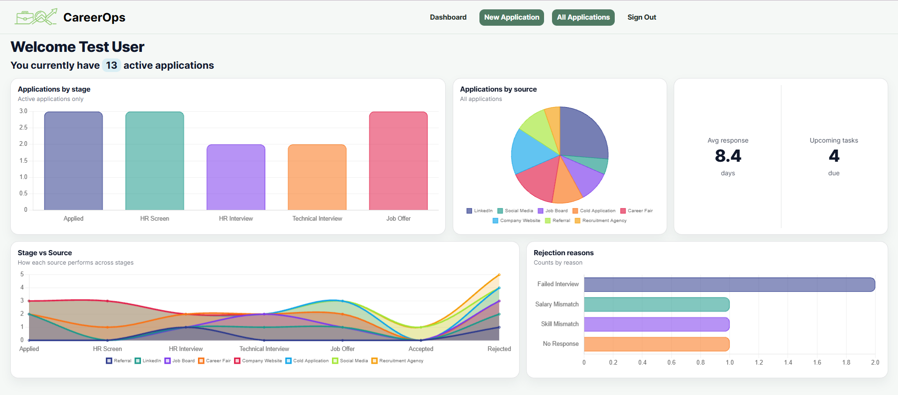
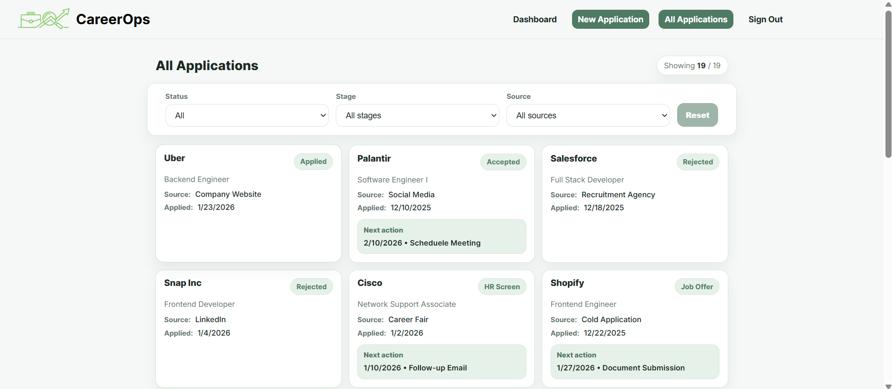
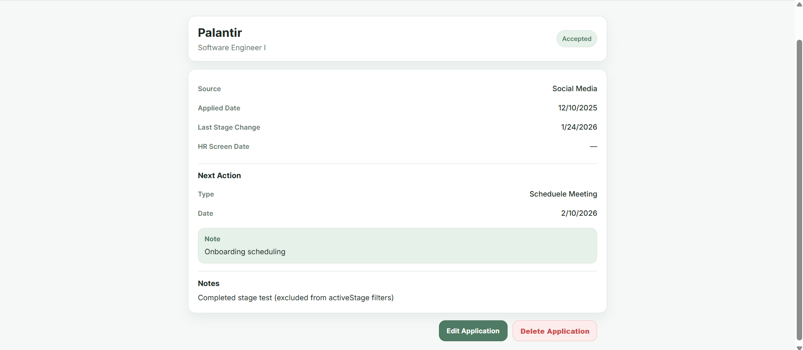

# 📊 CareerOps

CareerOps is a full-stack job application tracking and analytics platform built using RESTful conventions. It helps users manage their job applications, track progress across hiring stages, schedule follow-ups, and gain data-driven insights into their job search through an interactive analytics dashboard.

---

## 🧩 About the Project
CareerOps was designed to solve a common problem faced by job seekers: keeping track of multiple applications across different companies, stages, and sources. The platform allows users to log applications, update their progress over time, and record upcoming actions such as follow-ups or interviews.

Beyond basic tracking, CareerOps provides a personalized analytics dashboard that visualizes application data using charts and KPIs. Users can quickly understand how many applications are active, where they are getting rejected, which sources perform best, and how long it typically takes to hear back from employers.

---

### Dashboard Page

### All Applications view

### Application Details

---

## ✨ Features
- User authentication with JWT  
- Secure, user-scoped application data  
- Create, update, and delete job applications  
- Track application stage progression  
- Record next actions (follow-ups, interviews, reminders)  
- Automatic tracking of stage changes and response time  
- Analytics dashboard with real-time insights  
- Interactive data visualizations using Chart.js  
- Filter applications by status, stage, and source  
- Clean, responsive, dashboard-style UI  

---

## 📁 RESTful Routes Overview

### 🔐 Authentication
| Action | Method | Route | Description |
|------|--------|-------|-------------|
| Sign Up | POST | `/auth/sign-up` | Create a new user account |
| Sign In | POST | `/auth/sign-in` | Authenticate user and return JWT |

### 📄 Applications
| Action | Method | Route | Description |
|------|--------|-------|-------------|
| All Applications | GET | `/applications` | Retrieve all user applications |
| Create Application | POST | `/applications` | Create a new job application |
| Show Application | GET | `/applications/:applicationId` | View application details |
| Update Application | PUT | `/applications/:applicationId` | Edit an application |
| Delete Application | DELETE | `/applications/:applicationId` | Delete an application |

### 📊 Analytics
| Action | Method | Route | Description |
|------|--------|-------|-------------|
| User Analytics Summary | GET | `/useranalytics/summary` | Retrieve KPIs and chart data |

---

## 📈 Analytics Provided
- Total applications  
- Total active applications  
- Total rejected applications
- Average response time (Applied → HR Screen)  
- Applications by stage (bar chart)  
- Applications by source (pie chart)  
- Rejection reasons (horizontal bar chart)  
- Upcoming actions count  
- Stage vs source performance comparison (stacked area chart)  

---

## 🛠️ Technologies Used

### Frontend
- React  
- React Router  
- Chart.js  
- Axios  
- CSS Modules  

### Backend
- Node.js  
- Express  
- MongoDB / Mongoose  
- JWT Authentication  
- RESTful API Architecture  

---

## 🔗 Backend Repository
The backend API for this project can be found here:  
👉 **[CareerOps Backend Repository](https://github.com/safakhalaf026/CareerOpsBackend)**

---

## 📌 Attributions
- **Charting & Data Visualization**  
  https://www.chartjs.org/

## 🚀 Future Improvements
- Email reminders for upcoming actions  
- Export analytics as PDF or CSV  
- Job offer comparison view  
- AI-assisted application insights  
